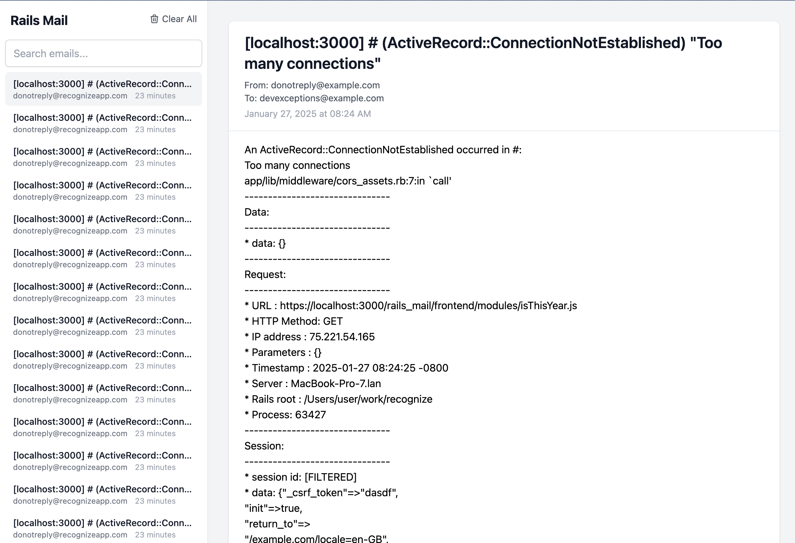

# RailsMail
RailsMail is a Rails engine that provides a database-backed delivery method for Action Mailer, primarily intended for local development and staging environments. It captures emails sent through your Rails application and provides a web interface to view them.

RailsMail saves all outgoing emails to your database instead of actually sending them. This is particularly useful for:
- Local development to inspect emails without setting up a real mail server
- Staging environments where you want to prevent actual email delivery
- Testing email templates and layouts



### Features
* Implements delivery_method for ActionMailer to catch emails and store them in the database
* Real-time updates using Turbo and ActionCable
* Search functionality across email fields (subject, from, to, cc, bcc)
* Infinite scrolling with customizable per-page count
* Clean, responsive UI for viewing email contents
* Optional authentication support
* Trimming emails older than a specified duration or a maximum number of emails
* Ability to manually clear emails in bulk or individually. The bulk delete can be turned on/off based on environment (eg, so that in Staging, other stakeholders can't clear emails out, but in dev sometimes you want a clean slate)
* Dynamic time ago in words using date-fns
* Ability to customize how the job that trims emails is enqueued
* Ability to customize the title in the top left of the page via a standard Rails view that overrides the engine's default view.
* Toggle between HTML & text-only views for emails.

## Installation

To install RailsMail, follow these steps:

1. **Add the gem to your application's Gemfile:**

   ```ruby
   gem "rails_mail"
   ```

2. **Run `bundle install` to install the gem:**

   ```bash
   $ bundle install
   ```

3. **Generate the necessary database migration:**

   Run the following command to create the migration for storing emails:

   ```bash
   $ rake rails_mail:install:migrations
   ```

4. **Run the migration:**

   Apply the migration to your database:

   ```bash
   $ rails db:migrate
   ```

5. **Start your Rails server and access the RailsMail interface:**

   Visit `http://localhost:3000/rails_mail` to view captured emails.


## Usage

To use RailsMail in your application:

1. **Configure Action Mailer to use RailsMail as the delivery method:**

   Add the following configuration to your `config/environments/development.rb` (or `staging.rb`):

   ```ruby
   config.action_mailer.delivery_method = :rails_mail
   ```

2. **Mount the engine in your routes:**

   Add the following line to your `config/routes.rb`:

   ```ruby
   mount RailsMail::Engine => "/rails_mail"
   ```

3. **Configure the initializer**
   See the [Configuration](#configuration) section for more details.

4. **Visit `/rails_mail` (or where ever you mounted the engine) in your browser to view all captured emails.**

### Configuration

RailsMail can be configured through an initializer:

```ruby
# config/initializers/rails_mail.rb
RailsMail.configure do |config|
  # Optional authentication callback
  # (if using Authlogic. If using Devise see the Authentication section)
  config.authenticate do
    user_session = UserSession.find
    raise ActionController::RoutingError.new('Not Found') unless user_session&.user&.admin?
  end

  # Optional decide whether to show the clear button
  # Useful if you want devs in local envs to be able to clear all emails, but not in staging
  config.show_clear_all_button do
    Rails.env.development?
  end

  # Delete emails older than the specified duration
  config.trim_emails_older_than = 30.days

  # Keep only the most recent N emails
  config.trim_emails_max_count = 1000

  # Control whether trimming runs synchronously (:now) or asynchronously (:later)
  config.sync_via = :later

  # Per-page count for infinite scroll
  config.per_page = 20
end
```

### Configuration Options

- `authentication_callback`: A block that will be called before accessing RailsMail routes
- `trim_emails_older_than`: Accepts an ActiveSupport::Duration object (e.g., 30.days). Emails older than this duration will be deleted.
- `trim_emails_max_count`: Keeps only the N most recent emails, deleting older ones.
- `sync_via`: Controls whether the trimming job runs synchronously (:now) or asynchronously (:later)

### Custom Renderers

RailsMail supports custom renderers that allow you to add new ways to display emails. For example, you could add a renderer for markdown emails or a special format your application uses.

By default, RailsMail includes these renderers:
- HTML renderer: Displays HTML email content
- Text renderer: Displays plain text email content
- Exception Notifier renderer: Provides formatted display of exception emails from the ExceptionNotifier gem

#### Creating a Custom Renderer

1. Create a new renderer class that inherits from `RailsMail::Renderer::Base`:

```ruby
# app/renderers/markdown_renderer.rb
module RailsMail
  module Renderer
    class MarkdownRenderer < Base
      def self.handles?(email)
        email.content_type&.include?("text/markdown")
      end

      def self.partial_name
        "rails_mail/emails/markdown_content"
      end

      def self.title
        "Markdown"
      end

      def self.priority
        5 # Between Text and Exception renderers
      end

      def self.data(email)
        { markdown_content: process_markdown(email.text_body) }
      end

      private

      def self.process_markdown(text)
        # Your markdown processing logic here
        text
      end
    end
  end
end
```

2. Create a partial for your renderer:

```erb
# app/views/rails_mail/emails/_markdown_content.html.erb
<div class="mt-3 markdown-content">
  <%= markdown_content %>
</div>
```

3. Register your renderer in an initializer:

```ruby
# config/initializers/rails_mail.rb
RailsMail.configure do |config|
  # ... other configuration ...
end

# Register custom renderers after configuration
RailsMail::RendererRegistry.register(RailsMail::Renderer::MarkdownRenderer)
```

#### Renderer API

Custom renderers must implement these class methods:

- `handles?(email)`: Returns true if this renderer should handle the email
- `partial_name`: Returns the path to the partial that renders the content
- `title`: (optional) The tab title. Defaults to the class name without "Renderer"
- `priority`: (optional) Order in which renderers appear. Lower numbers appear first
- `data(email)`: (optional) Additional data to pass to the partial. Returns a hash

### Customize the title
Since this is a Rails engine, you can customize the title by creating a file at `app/views/layouts/rails_mail/_title.html.erb`.

```erb
<h1 class="text-xl font-bold">My apps mails</h1>
```

## Authentication
Authentication is optional, but recommended and will depend on your application's authentication setup. This gem provides an `authentication_callback` that you can configure in the initializer which is helpful for Authlogic. If you are using Devise, you can simply wrap the mount point of the engine. 

### Authlogic

If you're using Authlogic, configure the authentication in the initializer:
```ruby
# config/initializers/rails_mail.rb
RailsMail.configure do |config|
    config.authentication_callback do
      user_session = UserSession.find
      # Provide a more helpful message in development
      msg = Rails.env.development? ? 'Forbidden - make sure you have the correct permission in config/initializers/rails_mail.rb' : 'Not Found'
      raise ActionController::RoutingError.new(msg) unless user_session&.user&.admin?
    end
  end
end
```

### Devise

If you're using Devise, you can simply wrap the mount point of the engine using Devise's `authenticate` route helper.

```ruby
# config/routes.rb
authenticate :user, ->(user) { user.admin? } do
    mount RailsMail::Engine => "/rails_mail"
end
```

## Real-time updates

RailsMail uses Turbo, TurboStreams, and ActionCable to provide real-time updates in the ui when emails are delivered. When you send an email, the new email will be displayed in the list of emails. There may be gotchas depending on your setup and environment.

## Gotchas

- In development environment, the typical default for ActionCable (cable.yml) is to use the async adapter which is an in-memory adapter. If you try to send an email from the rails console, it will not auto-update the ui. You can change the adapter to the development adapter by running `cable.yml` to use something like the redis, postgresql adapter, or solidcable. 
- In staging environments, the same idea typically applies that you need to use a multi-process adapter like redis, postgresql, or solidcable.
- Inline `<style>` tags will be sanitized in email bodies.

## Future work / ideas

- Implement infinite scroll rather than loading all emails at once
- Implement adapters to support real-time updates without ActionCable (polling or SSE)
- Implement attachments support
- Implement introspection of application notifiers and allow manual delivery/inspection of emails
  - Need to introspect the arguments of the notifier and see if the arguments can be paired with active record models or to allow a mapping of argument type to sample data / fixtures. 
- Implement read/unread functionality
- Allow clients to add additional acceptable HTML tags to render

## Contributing
Contribution directions go here.

## License
The gem is available as open source under the terms of the [MIT License](https://opensource.org/licenses/MIT).

